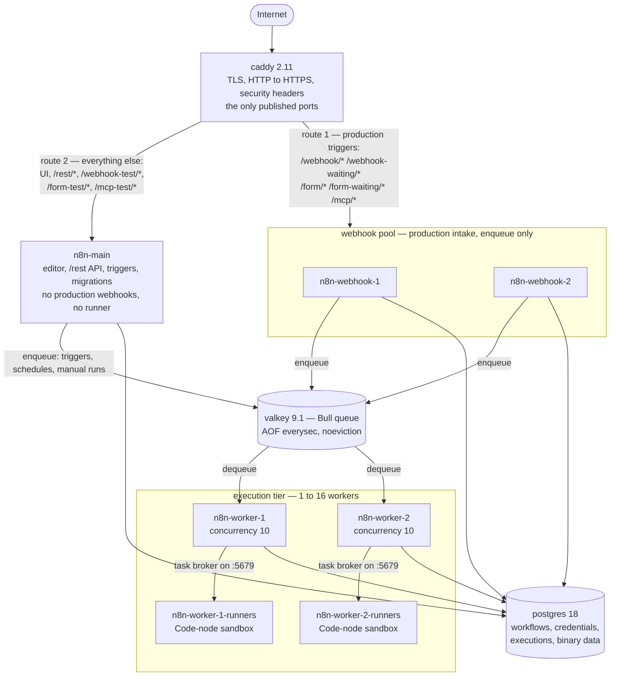

# Architecture

The kit runs n8n in **queue mode** on one Docker host: an edge proxy, one main process, a pool of webhook
processors, N workers with their own Code-node sandboxes, a Valkey queue and a Postgres database. Two rules
shape the whole thing. **One job per process:** the editor, the production webhook intake and the execution of
workflows are three different failure domains, so they are three different containers. **Nothing is reachable
that does not need to be:** only `caddy` publishes a port, and the database, the queue and the Code-node
sandboxes sit on a network with no route out of the host at all.

## The shape of the stack

## The edge

`caddy` is the only container with published ports: `HTTP_PORT` (default 80) for the ACME HTTP-01 challenge and
the permanent redirect, `HTTPS_PORT` (default 443) for TLS, and the same HTTPS port on UDP for HTTP/3. The
certificate comes from `TLS_MODE`: `acme` (Let's Encrypt), `acme-staging` (rehearsals without the production
rate limits) or `internal` (Caddy's own CA, for names such as `n8n.localtest.me`).

Every response carries HSTS, `nosniff`, `X-Frame-Options SAMEORIGIN`, a strict referrer policy, a
`Permissions-Policy` that switches off camera, microphone and geolocation, and no `Server` banner — including
the 502s and 401s Caddy generates itself, which bypass the normal header handler and so are covered again in
`handle_errors`. Request bodies are capped at **64 MiB**, the access log drops request headers so that API keys
are not logged in clear text, and the admin API stays on `localhost:2019`.

## The routing split

This is the subtle part, and the part a misconfiguration breaks quietly.

| Path | Goes to | Why |
|---|---|---|
| `/webhook/*`, `/webhook-waiting/*`, `/webhook-waiting-slack*`, `/webhook-waiting-telegram*`, `/form/*`, `/form-waiting/*`, `/mcp/*` | webhook pool | production triggers; the pool only enqueues |
| `/healthz/webhook` | webhook pool, rewritten to `/healthz` | liveness of the pool |
| `/healthz` | `n8n-main` | liveness of main |
| `/metrics*`, `/grafana/metrics*` | `404` | never public; Prometheus scrapes the processes directly |
| `/grafana/*` | `grafana:3000` | monitoring profile only; 502 without it |
| everything else — `/`, `/rest/*`, `/webhook-test/*`, `/form-test/*`, `/mcp-test/*`, `/chat`, `/push` | `n8n-main` | editor, API, test runs, websocket push |

The **production** endpoints go to the pool; the **test** endpoints do not. The editor's "Test workflow"
session lives inside the main process, so `/webhook-test/`, `/form-test/` and `/mcp-test/` only work there, and
a webhook process answers `Cannot GET` for `/rest/*` and the UI. The Slack and Telegram human-in-the-loop
callbacks carry no trailing slash in n8n, which is why those two matchers have none either, and a bare
`/webhook` or `/form` with no path after it stays on main because n8n always generates `/webhook/<id>`. All of
these are n8n's own default endpoint paths — the kit does not override them.

`n8n-main` additionally runs with `N8N_DISABLE_PRODUCTION_MAIN_PROCESS=true`, so it stops mounting the
production webhook, form, waiting and MCP paths at all. That is belt and braces on purpose, and the braces are the half that matters: even with the flag set, a misrouted `/webhook/x` still falls through to the editor single-page app and answers **HTTP 200 with HTML** instead of a 404 (verified) — the caller sees success and the workflow never runs. That is why Caddy routes the production paths explicitly and why `make smoke` asserts `X-Kit-Upstream` on each of them.

Every proxied response is stamped `X-Kit-Upstream: <service>:5678`, so you can always see which process
answered; `make smoke` asserts that header path by path.

The pool is load-balanced round robin, and retries happen only when a member cannot be **dialled**, never after
it has sent a response — a webhook POST is not replayed into a second member. Health checks use
`/healthz/readiness`, not `/healthz`, because a starting n8n answers `/healthz` with 200 as soon as its HTTP
server listens, and until it is connected and migrated it answers every other path with 200 and "n8n is
starting up". A webhook sent to such a member would get a 200 that never ran anything.

Optional UI protection (`UI_PROTECT=on`) is imported into two handlers only — the catch-all and `/grafana/*` — as an IP allow-list
(`UI_ALLOW_CIDR`) evaluated before basic auth. Production webhooks, forms, MCP and the health paths are matched
earlier and stay open.

## Two request paths, end to end

**A production webhook.** Caddy terminates TLS, applies the headers, matches `/webhook/*` and picks a healthy
pool member. That process looks the workflow up in Postgres, pushes a job into the Bull queue on Valkey and
answers. A worker picks the job up and executes it, handing any Code node to its runner sidecar, and writes the
execution to Postgres. Main is not in this path at all, which is why restarting it does not interrupt inbound
traffic.

**A UI action.** Caddy matches the catch-all, applies UI protection if it is on, and proxies to `n8n-main`,
which serves the editor bundle and `/rest/*` and holds the websocket push connection. When you press "Test
workflow", `OFFLOAD_MANUAL_EXECUTIONS_TO_WORKERS=true` sends that run through the same queue to a worker, so
main starts no task broker, needs no runner sidecar of its own, and stays responsive while your workflow runs.

## Workers and their runners

Each worker runs `n8n worker --concurrency=${WORKER_CONCURRENCY}` (default 10) and has **its own** runner
sidecar, `n8n-worker-N-runners`, from `n8nio/runners` at the same `N8N_VERSION` — the runners image must match
n8n's version, which is why the kit pins the two together. External task runners are not optional:
`N8N_RUNNERS_MODE=external` is the supported mode since n8n 2.0, and the deprecated internal mode cannot run
Python at all. The sidecar reaches its worker's task broker at `http://n8n-worker-N:5679`, which is why the kit
sets `N8N_RUNNERS_BROKER_LISTEN_ADDRESS=0.0.0.0`: the broker's default of `127.0.0.1` is unreachable from
another container.

The pairing is 1:1 because that is the sandbox boundary. The sidecar sits on the internal network only and
mounts no volumes, so **Code nodes have no network access and no `fetch`**. Use `this.helpers.httpRequest(...)`
or an HTTP Request node and the worker makes the call on the workflow's behalf. `RUNNERS_LANGS` is the
sidecar's command line — `"javascript python"` enables the native Python Code node.

Scaling therefore adds pairs: `make scale-workers N=4` (range 1 to 16) writes `WORKER_REPLICAS`, regenerates
`compose.scale.yml` with workers 3..N and their sidecars, and converges the stack.

## Queue, database and the shared volumes

**Valkey** holds the Bull queue under the key prefix `n8n` on database 0, with
`--appendonly yes --appendfsync everysec`, no RDB snapshots, and
`--maxmemory 256mb --maxmemory-policy noeviction`. AOF is what makes a queued job survive a restart: at most
one second of writes is at risk. `noeviction` matters more than it looks — Bull cannot survive having keys
evicted underneath it, so a full broker must **error** on the next write rather than quietly drop somebody's
job. An error is visible and recoverable; an eviction is a job that never ran and nobody noticed.

**Postgres 18** holds everything n8n persists — workflows, credentials, executions and, because
`N8N_DEFAULT_BINARY_DATA_MODE=database`, binary data too. Filesystem binary mode is unsupported in queue mode
and the S3/Azure modes need a paid licence, so `database` is set explicitly rather than left to a default. It
runs with `max_connections=150` against a per-process pool of 4, which keeps even 16 workers well under the
limit.

All five n8n processes share two volumes. `n8n_data` at `/home/node/.n8n` carries the settings file, the event
log and installed community packages — shared so that a community node is visible to every worker. `n8n_files`
at `/home/node/.n8n-files` is the only tree the Read/Write Files node may touch, kept separate so user files
never land in the config tree. Neither volume is part of the backup bundle; see
[Backup and restore](operations/backup-restore.md).

## Networks and hardening

| Network | Members | Routable? |
|---|---|---|
| `internal` | `caddy`, `postgres`, `valkey`, all five n8n processes, the runner sidecars, `backup`, Prometheus | no — `internal: true`, no route out of the host |
| `proxy` | `caddy`, `n8n-main`, the webhook pool, the workers, `backup` | yes, outbound; nothing but caddy publishes |
| `monitoring` | Prometheus, Grafana, Loki, Alloy, node-exporter, cAdvisor | no |
| `edge-grafana`, `edge-kuma` | `caddy` plus that one service | yes |

Postgres, Valkey and the runner sidecars are attached to `internal` **only**. The workers are also on `proxy`
because HTTP Request and API nodes execute there and need egress. Loki and the exporters are kept off the
workers' networks on purpose: a user workflow can make an HTTP request to anything it can reach.

Every container runs with `restart: unless-stopped`, `no-new-privileges`, a memory limit from `MEM_LIMIT_*` in `.env`, and json-file logs capped at 20 MB × 5. Every container of the core stack also drops all capabilities (`cap_drop: [ALL]`) and runs on a read-only root filesystem — for the five n8n processes the tmpfs write set was measured with `docker diff` after a real workload. The optional `uptime-kuma` container is the one service without those last two. Startup order is `postgres`/`valkey` → `main`
→ webhooks and workers → runners, so database migrations run exactly once, on main, before anything else
connects. The n8n processes get `stop_grace_period: 40s`, above the 30-second
`N8N_GRACEFUL_SHUTDOWN_TIMEOUT` default, because Compose's 10 seconds would SIGKILL a worker mid-execution.

## What is deliberately not here

- **A second main process.** n8n's community edition supports one main; multi-main is an enterprise feature and
  is out of scope. Main is a single point of failure for the editor and for schedule triggers — not for
  inbound webhooks, and not for queued work.
- **Autoscaling.** `WORKER_REPLICAS` and `WORKER_CONCURRENCY` are the two knobs and you turn them yourself.
- **Replicated state.** One Postgres container, one Valkey container. The answer to losing them is encrypted
  backups with a weekly automated restore test, not failover.
- **A public `/metrics`.** It answers 404 at the edge; Prometheus scrapes each process over the backend network.

## What happens when X dies

Everything in this table was measured on a real stack — 2 vCPU / 7.7 GB, 2 workers at concurrency 10. The
drills, their assertions and the upstream sources are in [Chaos drills](operations/chaos-drills.md).

| Dies | What actually happens |
|---|---|
| `n8n-main` | Production webhooks are unaffected — 40/40 answered 200 across a restart. Schedule triggers pause until main is back, then resume on their own. The editor and `/rest` are down for the restart. |
| One webhook processor | Two transport failures within 30 s take it out of rotation for 30 s; the other member serves everything and the failed one is readmitted once `/healthz/readiness` passes again. |
| A worker, killed mid-flight | **Queued work is safe; in-flight work is lost.** Measured with 120 inputs: 110 succeeded, 10 ended as `crashed`, 0 as `error` — exactly one worker's concurrency. n8n hard-codes Bull's `maxStalledCount` to `0`, so a stalled job fails instead of being re-queued, and n8n 2.0 removed that retry deliberately. Run at least two workers (the stall sweep only happens inside a surviving one), drain with `docker stop` rather than killing, and give critical workflows an Error Workflow. |
| Valkey | Webhooks fail loudly while the queue is unreachable — 502/503, never a silent 2xx. Every service reconnects unaided and AOF keeps the queue: 321 jobs were waiting at the stop, 337 completed after it returned. |
| A container you killed yourself | Nothing. `docker kill` and `docker stop` cancel the container's restart manager, so `restart: unless-stopped` deliberately stays out of it — measured at 14 minutes down with `RestartCount=0`. Bring it back with `docker compose up -d`. |
| Postgres | Not covered by a drill. The database is the one component with no in-stack redundancy; its recovery path is [Backup and restore](operations/backup-restore.md). |

One more thing from the drills, because it changes how you recover: a `crashed` execution is **not** proof that
nothing happened. One run recorded 112 successes, 8 crashed — and 114 files on disk. Key your workflows so a
replay overwrites rather than duplicates.

## Capacity, as measured

On the same host, `make loadtest` absorbed a 200-job burst in **14 seconds**, sustained roughly **850
executions per minute**, took webhooks in at **40 requests per second** and peaked at a backlog of **161**.
That is one host on one workload shape, not a guarantee — measure your own before sizing anything on it.
